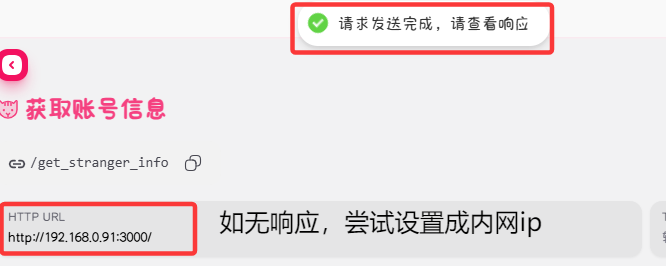

# DailyWife - QQ群每日老婆插件

### 前置需求（一定要看！）
本插件适合搭配napcat使用
本插件依赖Napcat api服务
- 在napcat面板设置服务端口


- 测试api可用性



- 如果可用，请进行最后一步配置


## 命令说明

1. **命令帮助**：输入 `/老婆帮帮我` 即可获取可用命令
2. **配对老婆**：输入 `/今日老婆` 即可配对老婆
3. **查询老婆**：输入 `/查询老婆` 可查看老婆具体信息
4. **我要分说**：输入 `/我要分手` 即可取消配对，并且二人在冷静期内无法再次配对在一起

## 管理员命令

-. **冷静期时长可配置**：通过管理面板修改冷静期时长，或者通过/冷静期 [小时数]，比如：
  ```bash
  /冷静期 48
  ```
  插件将设置分手冷静期为48h

-. **重置：**
  ```bash
  /重置 [群号]
  /重置 -a
  /重置 -c
  ```
  `/重置`后加`群号`，重置指定群聊配对数据，后加`-a`重置所有群聊，后加`-c`重置冷静期数据（在冷静期内的所有人）

- **屏蔽：**
  ```bash
  /屏蔽 [QQ号]
  ```
  插件将屏蔽该用户，被屏蔽的用户无法抽取老婆，也无法被抽到


## 注意事项

- 如不可用请先检查napcat api是否配置好并且可用
- 有问题请提issue
- 娱乐插件，切勿当真